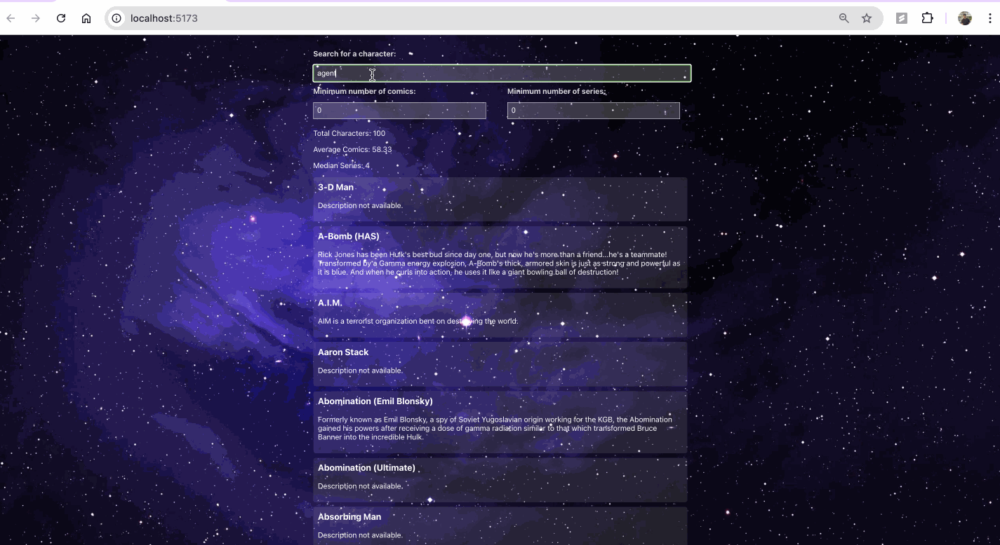

# Web Development Project 5 - *Data Dashboard*

Submitted by: **Haseeb Javed**

This web app: **This web app provides an interactive Marvel character dashboard, allowing users to explore characters from the Marvel universe. Users can filter characters by comic and series appearances and search for characters by name.**

Time spent: **7** hours spent in total

## Required Features

The following **required** functionality is completed:

- [X] **The list displays a list of data fetched using an API call**
- [X] **Data uses the useEffect React hook and async/await syntax**
- [X] **The app dashboard includes at least three summary statistics about the data such as**
  - [x] Total number of characters displayed
  - [x] Average number of comics appearances per character
  - [x] Median number of series appearances
- [X] **A search bar allows the user to search for an item in the fetched data**
- [X] **Multiple different filters (2+) allow the user to filter items in the database by specified categories**

The following **optional** features are implemented:

- [ ] Multiple filters can be applied simultaneously
- [ ] Filters use different input types such as a text input, a selection, or a slider
- [ ] The user can enter specific bounds for filter values

The following **additional** features are implemented:

* [ ] List anything else that you added to improve the site's functionality!

## Video Walkthrough

Here's a walkthrough of implemented user stories:

<!-- Replace this with whatever GIF tool you used! -->
GIF created with LICEcap  
<!-- Recommended tools:
[Kap](https://getkap.co/) for macOS
[ScreenToGif](https://www.screentogif.com/) for Windows
[peek](https://github.com/phw/peek) for Linux. -->

## Notes

### API Rate Limiting
* **Issue:** Exceeded Marvel API rate limits due to frequent requests.
* **Solution:** Implemented caching and optimized request frequency to reduce API calls.

### API Key Security
* **Issue:** Protecting sensitive Marvel API keys.
* **Solution:** Used environment variables during development and a backend proxy to shield the frontend from the private key.

### Responsive Design
* **Issue:** Ensuring a consistent user experience across different devices.
* **Solution:** Utilized media queries and flexible CSS units to create an adaptive layout.

### Filter Complexity
* **Issue:** Coordinating multiple filters to dynamically update the character list.
* **Solution:** Employed React state management to efficiently update the character display based on filter changes.

### Lessons Learned
These challenges offered valuable insights into:
* Effective React state management
* API interaction and optimization
* Modern web development practices, including responsive design

## License

    Copyright [2024] [Haseeb Javed]

    Licensed under the Apache License, Version 2.0 (the "License");
    you may not use this file except in compliance with the License.
    You may obtain a copy of the License at

        http://www.apache.org/licenses/LICENSE-2.0

    Unless required by applicable law or agreed to in writing, software
    distributed under the License is distributed on an "AS IS" BASIS,
    WITHOUT WARRANTIES OR CONDITIONS OF ANY KIND, either express or implied.
    See the License for the specific language governing permissions and
    limitations under the License.